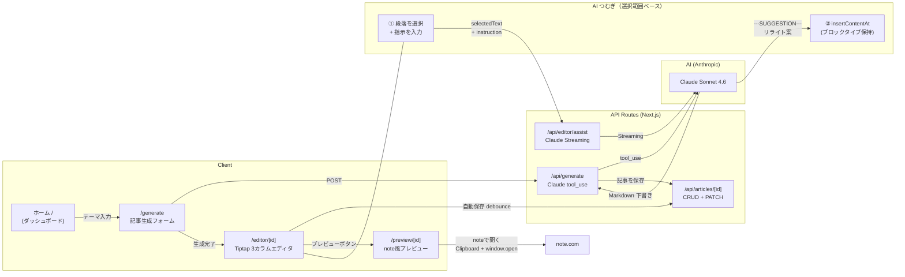

# つむぐ (Tsumugu)


**note クリエイターのための AI 共同執筆エディタ。**  
テーマとエピソードを入力すると Claude が下書きを生成し、3 カラムエディタで仕上げ、そのまま note.com へ投稿できます。右パネルの AI アシスタント「つむぎ」は段落を選択するだけで口調変更・具体例追加などのリライト提案を行います。

<!-- TODO: スクリーンショット追加（ダッシュボード・エディタ・プレビュー） -->

---

## Features

| Feature | Status | Description |
|---|---|---|
| AI 下書き生成 | ✅ | テーマ・エピソードを入力 → Claude が Markdown 形式で下書き生成 |
| リッチエディタ (Tiptap 3) | ✅ | 見出し / リスト / 引用 / マーカー / バブルメニュー / プレースホルダー |
| 選択範囲ベース AI 支援（つむぎ） | ✅ | 段落を選択 → 指示を送る → 提案をワンクリックで置換。ブロックタイプ（H2・blockquote 等）を保持 |
| 文体スタイル設定 | ✅ | フォーム式 UI で文体・構成・語彙を定義。既存 note 記事から AI が自動解析 |
| note 風プレビュー | ✅ | ヘッダー画像付きで note.com の紙面をリアルタイムに確認 |
| note 連携（半自動コピー） | ✅ | 「noteで開く」→ 整形済みテキストをクリップボードへコピー + note.com/notes/new を新タブで起動 |
| ライブラリ / 下書き管理 | ✅ | 生成済み記事一覧。進捗バーで目標文字数達成度を可視化 |
| AI・OUTLINE 提案 | 🔲 | 執筆を分析して構成改善を提案（v2 実装予定） |

---

## Tech Stack

| Category | Technology | Rationale |
|---|---|---|
| **Framework** | Next.js 16.2 (App Router) | Server Components + Route Handlers で API をフルスタック構成 |
| **UI Runtime** | React 19.2 | Concurrent Features / `use()` hook によるパラメータ処理 |
| **Language** | TypeScript 5 | 記事・スタイル・エディタデータの型安全を保証 |
| **Styling** | Tailwind CSS v4 (`@theme` tokens) | `--color-*` / `--font-*` トークンを CSS 変数で一元管理し、全コンポーネントで参照 |
| **Rich Editor** | Tiptap 3.23 | React 19 対応 peer deps、headless で Tailwind との競合なし。`StarterKit` + `Highlight` + `CharacterCount` + `Placeholder` を使用 |
| **AI** | Anthropic Claude API (`claude-sonnet-4-6`) | 下書き生成は tool_use、AI つむぎは SSE Streaming |
| **Markdown** | marked 18 / turndown 7 | Tiptap (HTML) ↔ Markdown の双方向変換。自動保存で debounce PATCH |
| **Storage** | ローカルファイルシステム (JSON) | v1 はサーバーレスより開発速度を優先。`data/articles/*.json` に保存 |
| **Fonts** | next/font/google (Noto Serif JP / Noto Sans JP / Bebas Neue / JetBrains Mono) | 日本語セリフ組版 + 英字ディスプレイをセルフホスト |
| **Deploy** | 未設定（v1 はローカル開発のみ） | v2 で Vercel + Supabase 移行を検討 |

---

## Architecture



---

## Getting Started

### Prerequisites

- Node.js 18+
- Anthropic API キー（[console.anthropic.com](https://console.anthropic.com) で発行）

### Installation

```bash
# 1. リポジトリをクローン
git clone https://github.com/your-username/note-generator.git
cd note-generator

# 2. 依存関係をインストール
npm install

# 3. 環境変数を設定
cp .env.local.example .env.local   # または手動で作成
```

`.env.local` の内容:

```env
ANTHROPIC_API_KEY=sk-ant-...
```

```bash
# 4. 開発サーバーを起動
npm run dev
```

[http://localhost:3000](http://localhost:3000) を開いてください。

### Build

```bash
npm run build
npm start
```

---

## Implementation Notes

### なぜ Tiptap 3 を選んだか

React 19 は peer dependency に `^17||^18||^19` を明記している Tiptap 3 が最適でした。
headless 設計のため Tailwind CSS v4 の `@theme` トークンと競合せず、
`blockquote` / `bulletList` / `orderedList` などのブロック構造をネイティブで扱えます。
SSR は `next/dynamic({ ssr: false })` で回避し、`immediatelyRender: false` でハイドレーションエラーを防止しています。

### 選択範囲ベースの AI つむぎ設計

```
段落を選択
   ↓
selectionUpdate イベント → EditorShell が from/to と ProseMirror ブロックタイプを記録
   ↓
送信時にスナップショット (savedRange + savedNodeType) を保存
   ↓
/api/editor/assist → Claude Streaming → ---SUGGESTION--- セパレータで分割表示
   ↓
「選択範囲を置き換える」ボタン → insertContentAt({ from, to }, html)
   ↓
buildReplacementHtml: heading → <h{level}>, blockquote > p → <p> (外側 BQ を維持)
```

`pos.node(1)` で doc 直下のブロックタイプを検出し、H2 を置換してもフォーマットが失われないよう設計しています。

### スタイル設定をフォーム式にした理由

初期実装は JSON 直編集でしたが、ユーザビリティの観点から廃止し、
`tone / structure / vocabulary / noteSpecific` の 4 グループに分けたフォーム UI に刷新しました。
AI 自動解析で初期値を生成し、フォームで微調整するワークフローが正しい導線と判断しています。

### ファイルシステム保存の現状と今後

v1 は開発速度を優先し、`data/articles/*.json` にフラットに保存しています。
v2 移行時は Supabase (Postgres) + Vercel Blob（画像）への移行を想定しています。

### デュアル EditorBody 問題の解決

`hidden lg:flex` / `lg:hidden` の CSS では React は両方をマウントします。
デスクトップ/モバイルで Tiptap インスタンスが二重になり、
`onEditorReady` が上書きされてカーソル位置がズレる問題が発生しました。
`window.matchMedia` で JS 側でブレークポイントを検出し、一度に 1 インスタンスのみマウントすることで解決しています。

---

## Development Story

このプロジェクトは「自分のnote記事作成フローを改善したい」という個人的な動機から始まり、段階的に機能を積み上げてきました。

### Phase 1–2.5: UI リデザイン + Tiptap エディタ

Create Next App のボイラープレートから出発し、Tailwind CSS v4 の `@theme` トークン体系、`next/font` による日本語 Web フォントのセルフホスト、UI コンポーネント群（Button / Card / Select / Toggle）の刷新を実施。
その後、`/editor/[id]` に 3 カラムシェルを構築し、Tiptap 3 + marked + turndown で Markdown ↔ HTML の双方向変換と自動保存を実装しました。

### Phase 3: AI つむぎ（選択範囲ベースの提案・置換）

Anthropic SDK の Streaming API と ProseMirror の `selectionUpdate` イベントを組み合わせた、段落単位のインライン AI 支援機能を実装。
「ブロックタイプの保持」「送信時スナップショット」「`---SUGGESTION---` セパレータによる提案分離」など、UX の細部まで設計を詰めました。

### ポリッシュフェーズ: 画面整理・ナビ刷新・機能追加

ルート整理（`/format→/library`、`/style→/settings`）、X スタイルのボトムナビ（5 要素・中央 FAB）、インフォメーション画面（`/info`）、プレビューのヘッダー画像連動、「noteで開く」ボタン（クリップボードコピー + note.com を新タブ）など、実用性とデザイン品質の両面を継続的に改善しました。

---

## Roadmap (v2)

### READMEを投げるだけで下書き生成

現在のテーマ・エピソード入力フォームに加え、README を貼り付けるだけで下書きが生成される**シンプルモード**を追加予定です。  
AI が README からテーマ・対象読者・構成を自動抽出し、出力モードを選択できるようにします。

- **技術記事モード**（Qiita / Zenn 想定）: 実装意図・つまずきポイントを重視
- **note 記事モード**（メイン用途）: 開発の裏側・物語性・感情的インサイトを重視

### 続編記事の自動生成

既存の note 記事を読み込ませ、文体・トーン・構成を維持したまま続編を生成します。シリーズ物を書くクリエイターを主な対象とします。

### リッチな画像対応

- 複数枚アップロードして画像ライブラリとして管理
- 本文中の任意位置への画像挿入（Tiptap Image 拡張）
- AI による画像配置提案（複数枚対応）
- ドラッグ&ドロップアップロード

### AI・OUTLINE 提案

エディタ左パネルに執筆内容の構成分析と改善提案を表示します（現在は「v2 実装予定」プレースホルダー）。

### Web アプリ化

X 等での反響があれば Vercel + Supabase 構成での一般公開を検討しています。

---

## License

© 2026 Haruto Miyakawa — All Rights Reserved.

本リポジトリのコードは著作権により保護されています。個人利用・学習目的での参照は歓迎しますが、再配布・商用利用は禁止します。
