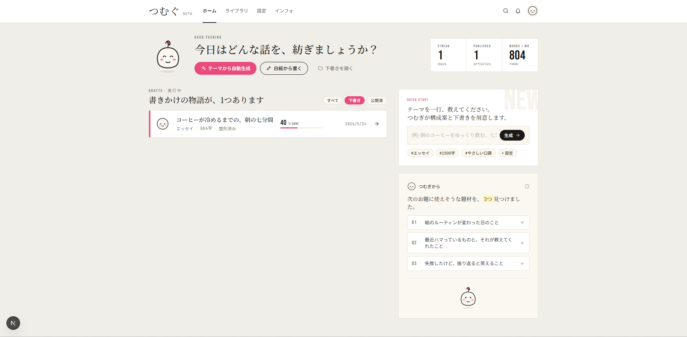
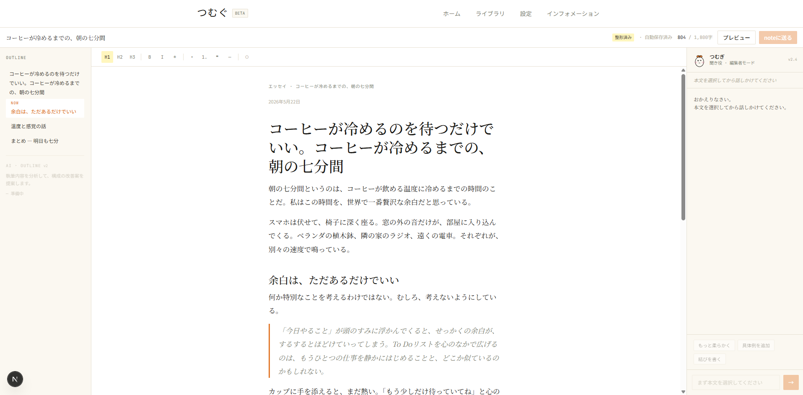
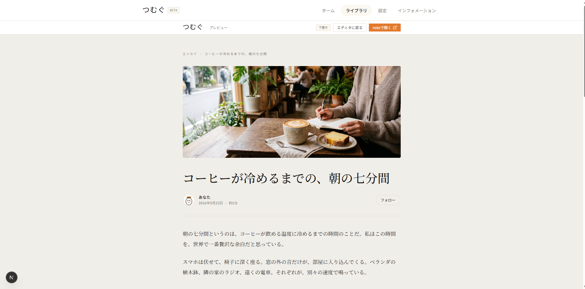
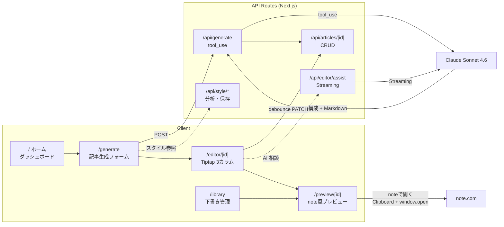

# つむぐ (Tsumugu)


> **note クリエイターのための AI 共同執筆エディタ。Claude が書き、つむぎが寄り添う。**
> 妥協なき創作のために、技術を磨く。

「つむぐ」は、テーマを一行入れるだけで Claude が下書きを生成し、3 カラムエディタで仕上げ、そのまま note.com へ運べるまでを一気通貫で支える個人開発のエディタです。右パネルに常駐する AI アシスタント「つむぎ」は段落を選ぶだけで口調変更・具体例追加などのリライト提案を出し、ブロックタイプを保ったまま本文を置き換えます。

v2.0 ではデザインシステムを根本から書き直しました。独自カラートークン、Noto Serif JP を基調にした組版、Bebas Neue のコンデンス英字ラベル、そしてオリジナルマスコット「つむぎ」を実装。AI を「魔法」ではなく**黒子**として可視化する哲学を、見た目と振る舞いの両方に落とし込んでいます。

---

## Screenshots

| ホーム | エディタ | プレビュー |
|---|---|---|
|  |  |  |

- **ホーム**：執筆ダッシュボード。STREAK / PUBLISHED / WORDS / WK を Bebas Neue のコンデンス数字で表示。クイックスタートとつむぎからの題材提案を並置。
- **エディタ**：3 カラム構成（OUTLINE / 本文 / AI つむぎ）。NOW バッジで現在編集中の見出しをアクセントピンクで明示。AI 提案は黄マーカーで本文に溶け込ませる。
- **プレビュー**：note.com 風の組版。Noto Serif JP 17px / 行間 1.95 を死守し、見出し H2 にはアクセント色 4px の縦罫。

---

## Features

| Feature | Status | Description |
|---|---|---|
| AI 下書き生成 | ✅ | テーマ・エピソードを入力 → Claude が構成案 + Markdown を生成 |
| Tiptap 3 ベースの 3 カラムエディタ | ✅ | OUTLINE / 本文 / AI つむぎ。`StarterKit` + `Highlight` + `CharacterCount` + `Placeholder` |
| 選択範囲ベースの AI つむぎ | ✅ | 段落を選択 → 指示 → 提案。**ブロックタイプ（H2・blockquote・list）を保持したまま置換** |
| **マスコット「つむぎ」** | ✅ | オリジナル SVG（豆型 + 結び目）。5 表情（idle / thinking / writing / happy / wink）。AI ストリーミング状態と mood が連動 |
| **v2.0 デザインシステム** | ✅ | 独自 `@theme` トークン + マスコット + UI プリミティブ（Btn / Chip / Icon / BigNum / SectionHead / ImgPlaceholder） |
| 文体スタイル設定 | ✅ | フォーム式で文体・構成・語彙を定義。既存 note 記事から AI が自動解析（`tool_use` で構造化抽出） |
| note 風プレビュー | ✅ | ヘッダー画像連動・読了時間表示・著者アバター |
| note 連携（半自動コピー） | ✅ | 「noteで開く」→ 整形済みテキストをクリップボードへ + `note.com/notes/new` を新タブ |
| ライブラリ / 下書き管理 | ✅ | 進捗バーで目標文字数達成度を可視化。最新記事はアクセント縦バー |
| README から自動入力 | 🔲 | v3.0 計画中。`docs/v3-planning.md` 参照 |
| リッチな画像対応（複数枚 / 本文中挿入） | 🔲 | v3.0 以降 |
| 続編記事の自動生成 | 🔲 | 既存記事の文体維持。v3.0 以降 |
| AI・OUTLINE 提案 | 🔲 | 執筆分析と構成改善提案。v3.0 以降 |

---

## Tech Stack

| Category | Technology | Rationale |
|---|---|---|
| **Framework** | Next.js 16.2 (App Router) | Server Components + Route Handlers でフルスタック構成。Turbopack で開発時のリロードを高速化 |
| **UI Runtime** | React 19.2 | Concurrent Features、`use()` フックでパラメータをサーバ側から受け取る |
| **Language** | TypeScript 5 | 記事・スタイル・エディタデータの型安全。`tool_use` レスポンスも型で縛る |
| **Styling** | Tailwind CSS v4 (`@theme` tokens) | `--color-*` / `--font-*` / `--radius-*` / `--shadow-*` を CSS 変数で一元定義。全コンポーネントがユーティリティで参照 |
| **Rich Editor** | Tiptap 3.23 | ProseMirror の力を保ちつつ Headless で Tailwind と非干渉。React 19 対応の peer deps |
| **AI** | Anthropic Claude API (`claude-sonnet-4-6`) | 下書き生成は `tool_use` で構造化、AI つむぎは SSE Streaming |
| **Markdown** | marked 18 / turndown 7 | Tiptap (HTML) ↔ Markdown の双方向変換。自動保存は debounce PATCH |
| **Storage** | ローカルファイルシステム (JSON) | 個人開発フェーズは速度優先。`data/articles/*.json` |
| **Fonts** | next/font/google | Noto Serif JP（本文）/ Noto Sans JP（UI）/ Bebas Neue（英字ラベル・数字）/ JetBrains Mono（メタ）の 4 種をセルフホスト |
| **Test** | Vitest + Testing Library + jsdom | コンポーネント・ユーティリティのユニットテスト基盤 |

---

## Architecture

### 全体データフロー



### AI つむぎの選択範囲ベース動作

```mermaid
sequenceDiagram
    participant U as ユーザー
    participant E as Tiptap Editor
    participant S as EditorShell
    participant A as /api/editor/assist
    participant C as Claude Sonnet 4.6

    U->>E: 段落を選択
    E->>S: selectionUpdate (from, to)
    S->>S: getEffectiveReplacement<br/>(ProseMirror node を検出)
    S->>S: savedRange + savedNodeType を保存

    U->>S: 指示を入力 → 送信
    S->>A: { instruction, selectedText, fullContext }
    A->>C: Streaming + system prompt
    C-->>A: 観察コメント
    C-->>A: ---SUGGESTION---
    C-->>A: リライト案
    A-->>S: chunked stream

    U->>S: 「選択範囲を置き換える」
    S->>E: insertContentAt(range, html)<br/>※ blockquote / heading を保持
    Note over S,E: H2 → &lt;h2&gt;, BQ内段落 → &lt;p&gt;
```

---

## Design Philosophy

つむぐ v2.0 のデザインは、**3 原則**から導出されています。

### 1. note の落ち着きを土台にする

* 背景は `#F0EEE9`（ウォーム生成り）。紙とインクの低彩度トーン。
* 本文は **Noto Serif JP 17px / line-height 1.95**（note.com と同等）。
* 影は使わず、`#E6E0D2` の罫線で面を区切る。角丸は最大 4px（紙感を残す）。

### 2. ポップで遊び心のあるアクセントを一滴

* 英字ラベル・数値は **Bebas Neue**（コンデンス、字間広め）で「STREAK」「QUICK START」「NOW」を立てる。
* アクセント色は **ピンク `#E84B7C`**（旧 v1 はアンバー、v2.0 でホットピンクへ）。CTA・進行中・選択状態にのみ使用。
* フロート要素にはハードシャドウ `4px 4px 0 #1B1A17` を使い、ポップな浮遊感を一滴加える。

### 3. AI は黒子

* AI の提案は **黄マーカー `#FFF6BE`** で本文に溶け込ませる。チャットの全画面化や派手なエフェクトは置かない。
* マスコット「つむぎ」の口調ルール：**批評しない。観察した事実だけを伝える編集者**。
  例：「段落が3つ続いていて、少し息が詰まりそう。短い一文を挟みませんか？」
* mood は AI のライフサイクルと連動：`idle`（待機）→ `thinking`（入力中）→ `writing`（ストリーミング中）→ `happy`（生成完了）。

トークン定義は `app/globals.css` の `@theme` ブロックに一度だけ集約し、全コンポーネントは Tailwind ユーティリティ（`bg-bg` `text-ink` `font-serif` 等）で参照しています。コンポーネントに色やフォントサイズを直書きしない、というルールを徹底しました。

---

## Getting Started

### Prerequisites

* Node.js 20 以上
* Anthropic API キー（[console.anthropic.com](https://console.anthropic.com) で発行）

### Installation

```bash
# 1. リポジトリをクローン
git clone https://github.com/your-username/note-generator.git
cd note-generator

# 2. 依存関係をインストール
npm install

# 3. 環境変数を設定
cp .env.local.example .env.local
# .env.local の ANTHROPIC_API_KEY=sk-ant-... を実キーに置き換える
```

### `.env.local` の内容

```env
# Anthropic API キー（https://console.anthropic.com で発行）
ANTHROPIC_API_KEY=sk-ant-your-key-here
```

### Run

```bash
# 開発サーバー（Turbopack）
npm run dev
# → http://localhost:3000

# 本番ビルド
npm run build
npm start

# Lint
npm run lint
```

サンプル記事が `data/articles/sample.json` に同梱されているので、起動直後から `/editor/sample` と `/preview/sample` を試せます。

---

## Implementation Notes

LAPRAS をはじめ、コードを読んでくださる方への補足です。技術選定の理由と、設計上の判断ポイントを並べました。

### Tailwind CSS v4 と独自 `@theme` を維持した理由

v1 の途中で CSS Modules への移行を検討しましたが、v4 の `@theme` 機能だけで「トークンの一元定義」と「ユーティリティとしての型のような扱い」が両立できると判断し、Tailwind を続投しました。`app/globals.css` の `@theme` ブロックに色・フォント・角丸・影をまとめ、コンポーネント側は `bg-paper` `text-ink-soft` のような意味づけされたユーティリティでだけ参照します。色を `#XXXXXX` で直書きする逃げ道を塞ぐと、デザインの一貫性が自然に保たれます。

### Tiptap 3 を選んだ理由

ProseMirror の構造化 DOM が必要で、かつ Tailwind v4 と干渉しない Headless 設計を求めていました。Tiptap 3 は React 19 の peer deps を満たし、`blockquote` / `bulletList` / `orderedList` / `heading` をネイティブで扱えます。SSR は `next/dynamic({ ssr: false })` で回避し、`immediatelyRender: false` を指定してハイドレーションエラーを防いでいます。

### Claude API（Sonnet 4.6）を選んだ理由

* **日本語の自然さ**：エッセイ調の散文を生成させたときの語の選び方が国産 LLM より落ち着いている、というのが個人的な観測。
* **`tool_use` の構造化抽出**：スタイル設定の AI 自動解析や記事生成のレスポンスを JSON Schema で縛れる。手作業のパースが要らない。
* **Streaming の安定性**：AI つむぎの SSE ストリームで、`---SUGGESTION---` セパレータ前後の chunk が安定して届く。

### マスコット「つむぎ」を実装した理由

AI を「魔法」のように振る舞わせると、ユーザーはツールに振り回されます。マスコットを**観察者**として可視化することで、AI の状態（idle / thinking / writing / happy）と機能の挙動を一対一で結びつけました。マスコットがいるかどうかではなく、**AI のライフサイクルが mood として見えるかどうか**が本質的な体験差分です。

### 設計上の工夫: ブロックタイプ保持の置換

```text
段落を選択
   ↓
selectionUpdate → EditorShell が from/to と ProseMirror の depth-1 ブロックタイプを記録
   ↓
送信時にスナップショット (savedRange + savedNodeType) を保存
   ↓
/api/editor/assist → Claude Streaming → ---SUGGESTION--- でコメントと提案を分離
   ↓
「選択範囲を置き換える」ボタン → insertContentAt({ from, to }, html)
   ↓
buildReplacementHtml:
  - heading        → <h{level}>...</h{level}>
  - blockquote > p → <p>...</p>  ※ 外側の <blockquote> を維持
  - list > li > p  → <p>...</p>  ※ 外側の <ul>/<ol><li> を維持
  - paragraph      → <p>...</p>
```

`pos.node(1)` で doc 直下のブロックタイプを取得し、置換 HTML を構築するときに親要素（blockquote / list）を壊さないよう depth で分岐しています。H2 で書いた見出しに AI 相談しても見出しのまま戻ってくる、という当たり前の体験を担保するための実装です。

### 設計上の工夫: デュアル EditorBody 問題

CSS の `hidden lg:flex` / `lg:hidden` でデスクトップ / モバイル切替を書くと、React は両方の DOM をマウントします。Tiptap インスタンスが 2 つ走り、`onEditorReady` のコールバックが後勝ちで上書きされてカーソル位置がズレる事故が起きました。`window.matchMedia` で JS 側でブレークポイントを検出し、**一度に 1 インスタンスしかマウントしない**よう切り替えています（`EditorShell.tsx` 参照）。

### ファイルシステム保存の現状

v1 / v2.0 は `data/articles/*.json` にフラット保存しています。Web 公開する場合は Vercel + Supabase（Postgres）+ Vercel Blob（画像）への移行を予定。データモデル（`types/article.ts`）は移行を見越して既に型で固めてあるので、リポジトリ層を差し替えるだけで動く設計です。

---

## Roadmap

詳細は [`ROADMAP.md`](./ROADMAP.md) を参照してください。

| Phase | Status | 概要 |
|---|---|---|
| 1–4 | ✅ | スタイル設定 / AI 解析 / 記事生成 / 整形・プレビュー（v1 完成） |
| 5 — v2.0 デザイン刷新 | ✅ | デザイントークン / マスコット / UI プリミティブ / 全画面のトーン統一（2026 年 5 月完了） |
| 6 — v3.0「README から自動入力」 | 🚧 | `/generate` で README を貼り付けるだけでフォームを自動入力。プラットフォーム別（note / Qiita / Zenn）に最適化。設計は [`docs/v3-planning.md`](./docs/v3-planning.md) |
| 7 — リッチな画像対応 | 📋 | 複数枚アップロード / 本文中挿入 / AI 配置提案 / ドラッグ&ドロップ |
| 8 — 続編記事の自動生成 | 📋 | 既存記事の文体・トーン・構成を維持したまま次の記事を書く |
| 9 — AI・OUTLINE 提案 | 📋 | 執筆中の構成を分析し、見出しの分割・追加を提案 |
| 10 — Web アプリ化 | 📋 | 反響があれば Vercel + Supabase で一般公開 |

---

## License

© 2026 Haruto Miyakawa — All Rights Reserved.

本リポジトリは個人開発のポートフォリオです。コードを読んで学習・参考にしていただくのは歓迎しますが、**再配布・改変・商用利用はご遠慮ください**。ライセンス変更（MIT 等）の予定はありません。

---

## Credits

* **開発・デザイン**: [Haruto Miyakawa](https://portfolio-lp-chi.vercel.app/)
* **ポートフォリオ LP**: <https://portfolio-lp-chi.vercel.app/>
* **マスコット「つむぎ」**: オリジナル SVG（豆型 + 結び目モチーフ、原典なし）
* **AI 共同執筆**: Claude（Anthropic）

---

> **妥協なき創作のために、技術を磨く。**
